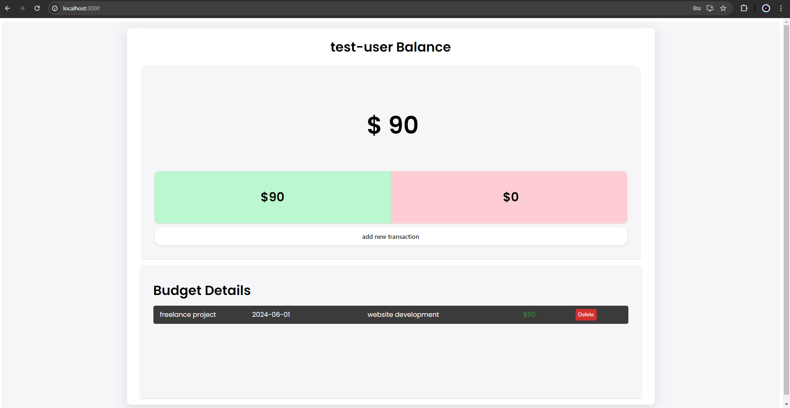
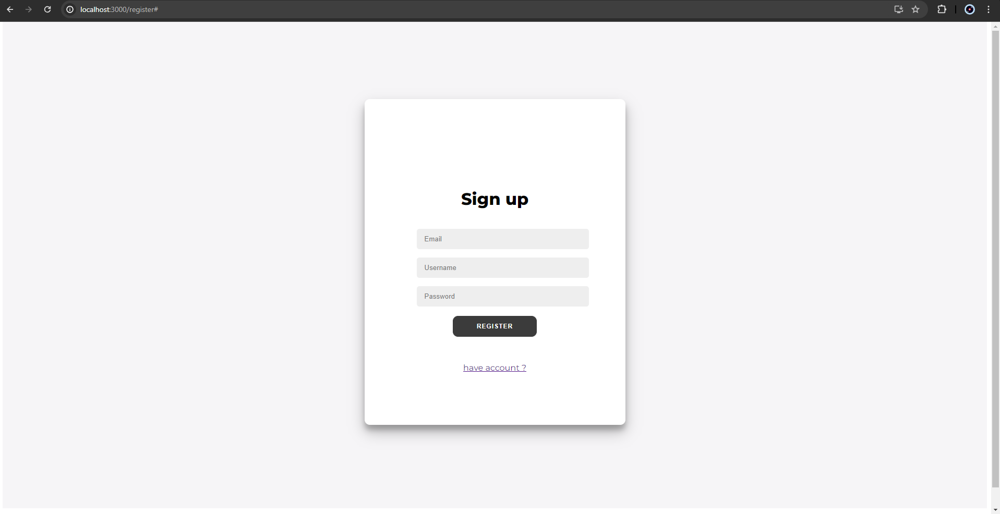
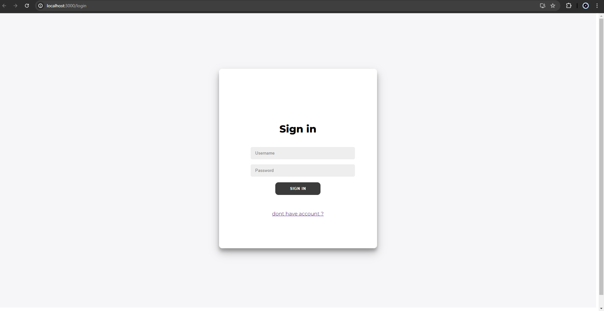
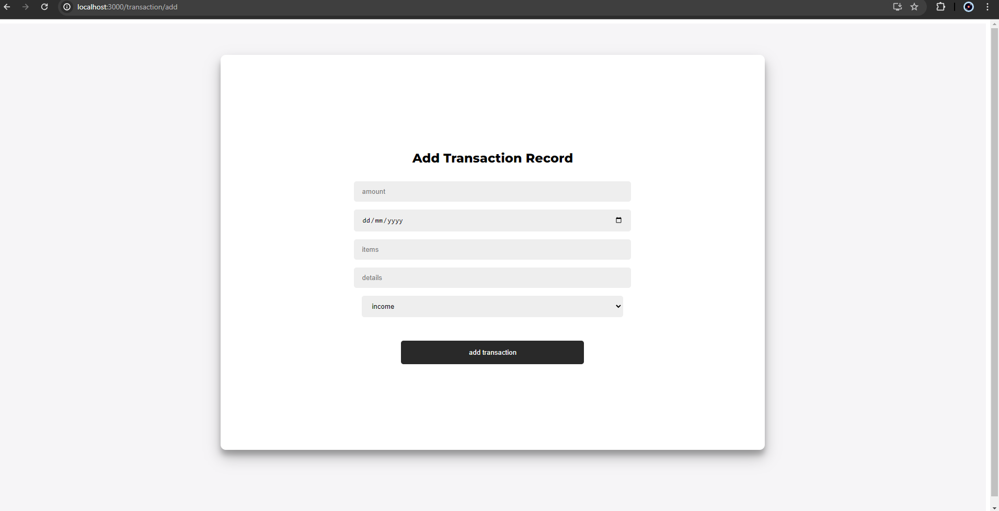
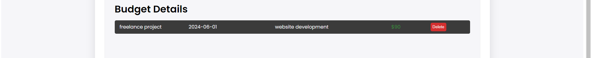

<!-- ABOUT THE PROJECT -->
## About The Project



This project is build to track all your income and expense, created using reactjs combined with nodejs, express and postgresql

<p align="right">(<a href="#readme-top">back to top</a>)</p>


### Built With

This section should list any major frameworks/libraries used to bootstrap your project. Leave any add-ons/plugins for the acknowledgements section. Here are a few examples.

* **ReactJS** for client side development 
* **SCSS** for styling client side react
* **NodeJS** for backend integrating with server 
* **Express** for backend logical operation
* **PostgreSQL** as database
* **JWT** for authentication

<p align="right">(<a href="#readme-top">back to top</a>)</p>


<!-- GETTING STARTED -->
## Getting Started

This is an example of how you may give instructions on setting up your project locally.
To get a local copy up and running follow these simple example steps.

### Prerequisites

This is an example of how to list things you need to use the software and how to install them.
* npm
  ```sh
  npm install npm@latest -g
  ```

### Installation

_Below is an example of how you can instruct your audience on installing and setting up your app. This template doesn't rely on any external dependencies or services._

1. Clone the repo
   ```sh
   git clone https://github.com/HillalXD/money-tracker.git
   ```
2. Install NPM packages
   ```sh
   npm install
   ```
3. Enter your CLI on /api to run server
   ```sh
   nodemon index.js
   ```

4. Enter your CLI on /client-side to run frontend
    ```sh
    npm start
    ```

<p align="right">(<a href="#readme-top">back to top</a>)</p>


<!-- USAGE EXAMPLES -->
## Usage

Use this space to show useful examples of how a project can be used. Additional screenshots, code examples and demos work well in this space. You may also link to more resources.

1. **User Registration**, this page will hit ```localhost://3030/authentication/register``` in server and create new user using your input




2. **User Login**, this page will hit ```localhost://3030/authentication/login``` in server and authenticate your input with user information in postgres, 
    if success it will sign the JWT token to browser




3. **Dashboard**, this page will hit ```localhost://3030/home``` in server and send all user information and transaction history in database to frontend


4. **Add transaction**, this page will hit ```localhost://3030/transaction/add``` in server and post a transaction record based on user data in form




5. **Delete**, this page will hit ```localhost://3030/transaction/delete``` in server and delete transcation record (using transactionID to filter)




<p align="right">(<a href="#readme-top">back to top</a>)</p>


<!-- LICENSE -->
## License

Distributed under the APACHE license. See `LICENSE.txt` for more information.

<p align="right">(<a href="#readme-top">back to top</a>)</p>
